# Employee-Database-Management

## INTRODUCTION

In this database management task, the goal is to create a database named 'Staff' to efficiently manage information about employees. Two tables, 'Employee_Info' and 'Employee_Salary,' are designed with appropriate constraints to organize data related to staff details and their salary information. These constraints ensure data accuracy, consistency, and reliability. The task involves inserting ten rows of information into both tables, and then crafting SQL queries to retrieve specific data. Additionally, table and column renaming, along with changes to data types and the addition of a new column, are performed to enhance the structure and functionality of the database. This task encompasses various aspects of database administration, including schema design, data insertion, querying, and schema modification, contributing to the effective management of employee information within the 'Staff' database.

## PROBLEM STATEMENT

1. Create a comprehensive database named 'Staff'. Within this database, create two tables, 'Staff_Info' and 'Staff_Salary', with specific constraints to ensure data integrity and accuracy. The structure of the tables should include the following columns:
   - 'Staff_Info' (ID, Name, Age, DOE, Contract_Duration)
   - 'Staff_Salary' (ID, Salary, Yearly_Increment)
2. Insert into 'staff_info' and 'staff_salary', ten (10) rows of informations
3. Construct SQL queries to extract specific details:
   - The Name and Age from the 'Staff_Info' table.
   - The ID and Salary from the 'Staff_Salary' table.
5. Rename the existing tables to 'Employee_Info' and 'Employee_Salary'
6. Change the 'ID' columns in both table to 'Employee_ID'
7. Alter the 'Employee_ID' columns data types to 'Text' data types
8. Create a new column named 'Department' in the 'Employee_Salary' table
9. For Employees with the following IDs, update their Departments with the specified:
   - IDs 1, 3, 7 = IT
   - IDs 2, 5, 9 = Advertising
   - IDs 4, 6, 8, 10 = Communications
10. Execute a query to retrieve the Month, Year, and Day of each employee's entry into the company
11. Execute and update a query to add 10 years to the entry year of each employee as their 'Year_of_Exit'
12. Replace the department ‘Communications’ with ‘Stakeholders’
13. Modify the 'Name' column to ensure that all values are in UPPER CASE
14. Execute a query to display the Employees' Names and Date of Entry (DOE) in a single column named 'Employee's Brief'.

## SKILLS AND CONCEPTS DEMOSTRATED

The task involves various skills and concepts related to database management and SQL. Here are the possible skills and concepts to be demonstrated:
1. Database Design:
   - Understanding of how to design a database schema, including defining tables, primary keys, and relationships.
2. Constraints:
   - Application of constraints such as primary key constraints, not null constraints, unique constraints, default constraints and foreign key constraints to ensure data integrity.
3. Data Insertion:
   - Knowledge of inserting data into tables, including handling constraints and ensuring data consistency.
4. SQL Queries:
   - Writing SQL queries to retrieve specific information from the database, including SELECT statements with various conditions.
5. Data Modification:
   - Ability to modify the structure of the database, including renaming tables, columns, and changing data types.
6. Data Types:
   - Understanding and handling data types, including converting data types to meet specific requirements.
7. Column Addition:
   - Adding new columns to existing tables to accommodate additional information.
8. Table Renaming:
   - Renaming tables to adhere to standardized naming conventions and improve table clarity.
9. Data Transformation:
   - Transforming data during retrieval, such as displaying concatenated values in a single column.
10. SQL Execution:
    - Executing SQL queries and modification statements using a database management system.
      
By completing the task successfully, one can demonstrate proficiency in these skills and concepts, showcasing a comprehensive understanding of database administration and SQL manipulation.

## RESULTS AND DISCUSSIONS

### 1. Create a comprehensive database named 'Staff'. Within this database, create two tables, 'Staff_Info' and 'Staff_Salary':

To initiate the creation of a database named 'staff' and simultaneously establish two tables, namely 'staff_info' and 'staff_salary' within the database, the initial set of commands to be employed are as follows:

```sql
CREATE DATABASE Staff;


USE Staff
CREATE TABLE Staff_Info
(ID INT NOT NULL,
Name VARCHAR(50) NOT NULL,
Age INT DEFAULT "25",
DOE DATE DEFAULT "2022-06-30",
Contract_Duration VARCHAR(50) DEFAULT "Three months");


USE Staff;
CREATE TABLE Staff_Salary
(ID INT UNIQUE,
Salary INT NOT NULL,
Yearly_Increment VARCHAR(50) DEFAULT "Three months");

To execute these commands, initiate the analysis by clicking the fourth icon within the workbench interface.
Subsequently, the 'staff' database, along with the 'staff_info' and 'staff_salary' tables, will be created.
```


Staff and Staff_Info        | Staff_Salary
:-----------------:|:------------------:
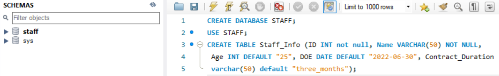    |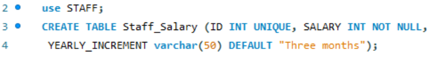


### 2. Insert into 'staff_info' and 'staff_salary', ten (10) rows of informations: 

To insert ten (10) rows of information into both tables, the 'insert' command will be utilized. The syntax for this command, which adds new data to a table, is as follows:

```sql
INSERT INTO Staff_Info
(Colunm 1, Column 2, Column 3, Column 4, Column 5), VALUES
(Value 1, Value 2, Value 3, Value 4, Value 5);

INSERT INTO Staff_Salary
(Colunm 1, Column 2, Column 3), VALUES
(Value 1, Value 2, Value 3);
```

Staff_Info Information        | Staff_Salary Information
:-----------------:|:------------------:
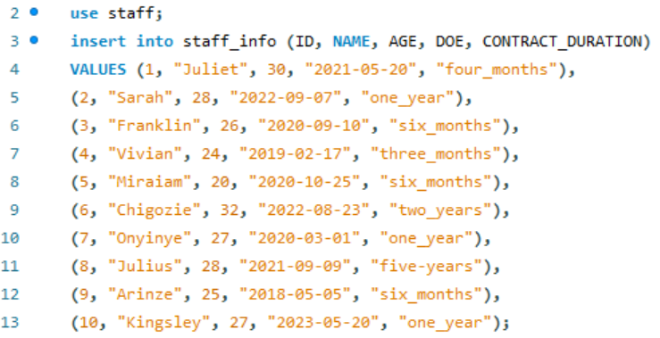    |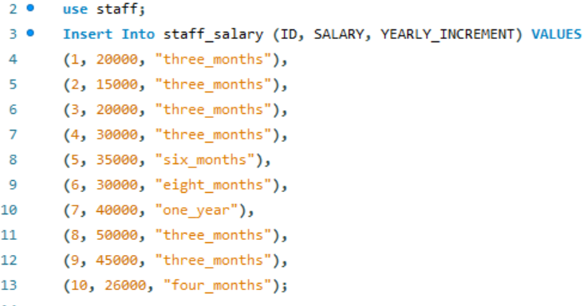


### 3. Construct SQL queries to extract specific details from 'staff_info' and 'staff_salary' tables:

To retrieve the name and age from the 'staff_info' table, as well as the ID and salary from the 'staff_salary' table, the 'SELECT' command will be utilized. The syntax for this command is as follows:

```sql
USE Staff;
SELECT Column 1, Column 2 FROM Staff_info;

USE Staff;
SELECT Column 1, Column 2 FROM Staff_Salary;
```

Name and Age        | ID and Salary
:-----------------:|:------------------:
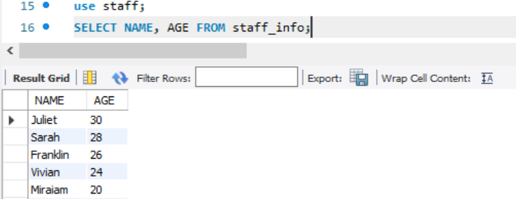    |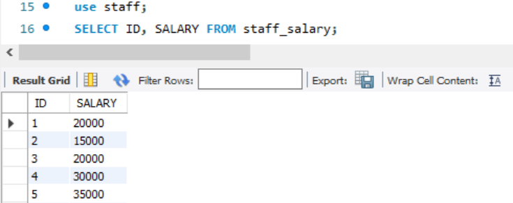


### 4. Rename the existing tables to 'Employee_Info' and 'Employee_Salary':

To rename the 'staff_info' and 'staff_salary' tables to 'employee_info' and 'employee_salary,' the 'ALTER' command will be used with the following syntax:

```sql
ALTER TABLE Old_table_name RENAME TO New_table_name;

Specifically, the commands for this task would be:

ALTER TABLE Staff_Info RENAME TO Employee_Info;
ALTER TABLE Staff_Salary RENAME TO Employee_Salary;

Executing these commands will change the original table names from 'staff_info' and 'staff_salary' to
'employee_info' and 'employee_salary,' respectively.
```

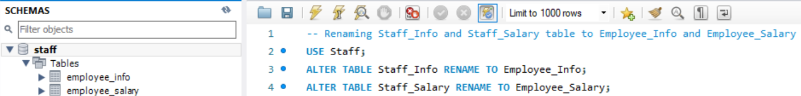

### 5. Change the 'ID' columns in both table to 'Employee_ID':

To modify the ID columns in both tables to 'Employee_ID,' the 'ALTER' command will be utilized with the following syntax:

```sql
ALTER TABLE Table_name CHANGE COLUN Old_column_name new_column_name Data_type;

Specifically, the commands for this task would be:

ALTER TABLE Employee_Info CHANGE COLUMN ID Employee_ID INT;
ALTER TABLE Employee_Salary CHANGE COLUMN ID Employee_ID INT;

The execution of these commands will change the initial ID column names to 'Employee_ID'.
```
Employee_Info Table        | Employee_Salary Table
:-------------------------:|:------------------:
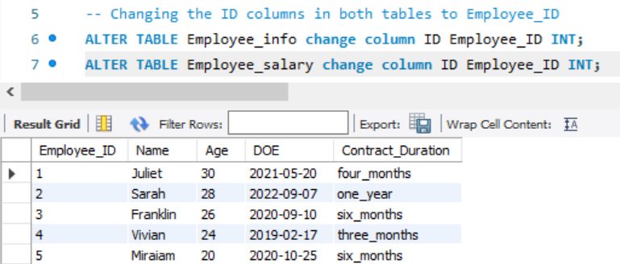            |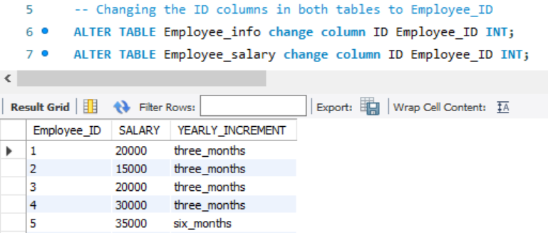

### 6.  Alter the 'Employee_ID' columns data types to 'Text' data types:

To modify the data types of the 'Employee_ID' columns to text (VARCHAR), considering that the initial data type is Integer (INT), the 'ALTER' command will be used with the following syntax:

```sql
ALTER TABLE Table_name MODIFY COLUMN Column_name VARCHAR(50);

The specific commands for this task are as follows:

ALTER TABLE Employee_Info MODIFY COLUMN Employee_ID VARCHAR(50);
ALTER TABLE Employee_Salary MODIFY COLUMN Employee_ID VARCHAR(50);

Executing these commands will alter the data types of the 'Employee_ID' columns from Integer to text (VARCHAR).
```

Employee_Info Table        | Employee_Salary Table
:-------------------------:|:------------------:
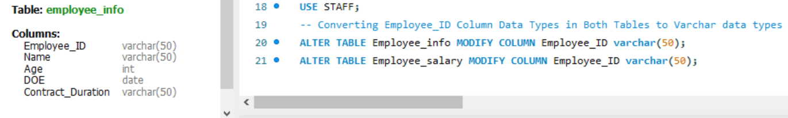            |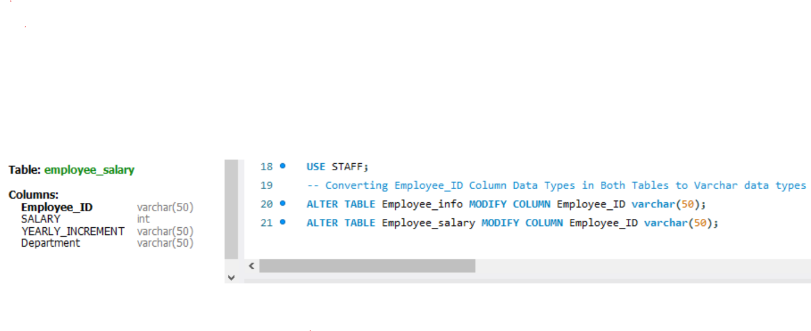

### 7.  Create a new column named 'Department' in the 'Employee_Salary' table

To add a new column named 'Department' to the 'Employee_Salary' table, the 'ALTER' command will be utilized with the following syntax:

```sql
ALTER TABLE Table_name ADD COLUMN New_column_name Data_type;

The specific command for this task is as follows:

ALTER TABLE Employee_Salary ADD COLUMN Department VARCHAR(50);

Upon executing this command, a new column named 'Department' will be created in the 'Employee_Salary' table.
```

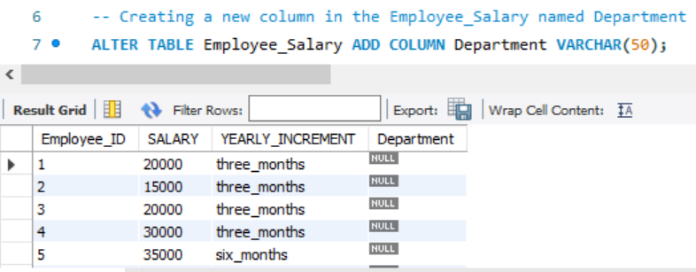

### 8. For Employees with the following IDs, update their Departments with the specified
   - IDs 1, 3, 7 = IT
   - IDs 2, 5, 9 = Advertising
   - IDs 4, 6, 8, 10 = Communications:

To update the 'Department' column with specific values, the 'UPDATE' command will be utilized with the following syntax:

```sql
UPDATE Table_name
SET Column_name =
CASE
WHEN Condition = Criteria THEN Value
-----
END;

The specific command for this task is as follows:

UPDATE Employee_Salary
SET Department =
CASE
WHEN Employee_ID = 1 THEN IT
WHEN Employee_ID = 2 THEN Advertising
WHEN Employee_ID = 4 THEN Communications
WHEN Employee_ID = 3 THEN IT
------
END;

Executing this command will perform the analysis and update the 'Department' column with values such as
'IT,' 'Advertising,' and 'Communications' where applicable.
```

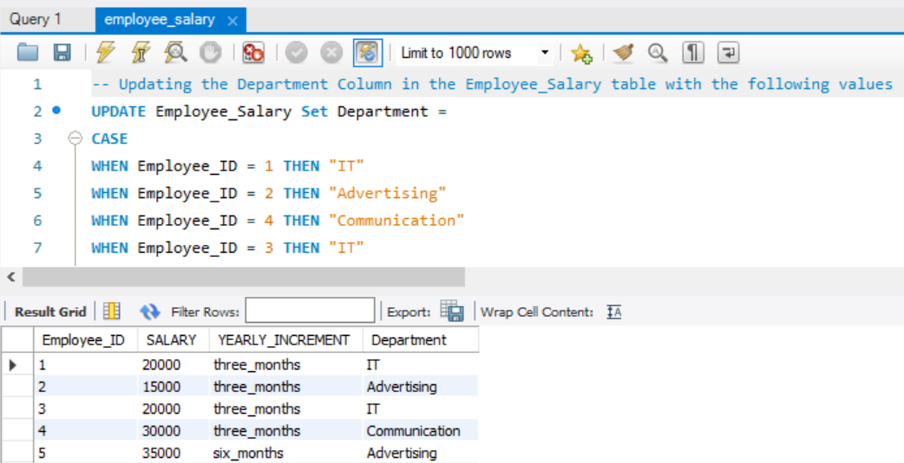

### 9. Execute a query to retrieve the Month, Year, and Day of each employee's entry into the company:

To execute a query for retrieving the month, year, and day of each employee's entry into the company, SQL date and time functions will be employed to manipulate date values. First, three columns, namely 'Year,' 'Month,' and 'Day,' should be added. Subsequently, each column will be updated by extracting values from the 'Date' column. The syntax for this operation is as follows:

```sql
UPDATE Table_name
SET Column_name = YEAR(Date_column) or MONTH(Date_column) or DAY(Date_column);

The specific commands for this task are outlined below:

UPDATE Employee_Info SET Year = YEAR(DOE);
UPDATE Employee_Info SET Month = MONTHNAME(DOE);
UPDATE Employee_Info SET Day = DAYNAME(DOE);

Executing this analysis will extract the year, month, and day from the 'Date' column and update the newly added 'Year,' 'Month,' and 'Day' columns, respectively.
```

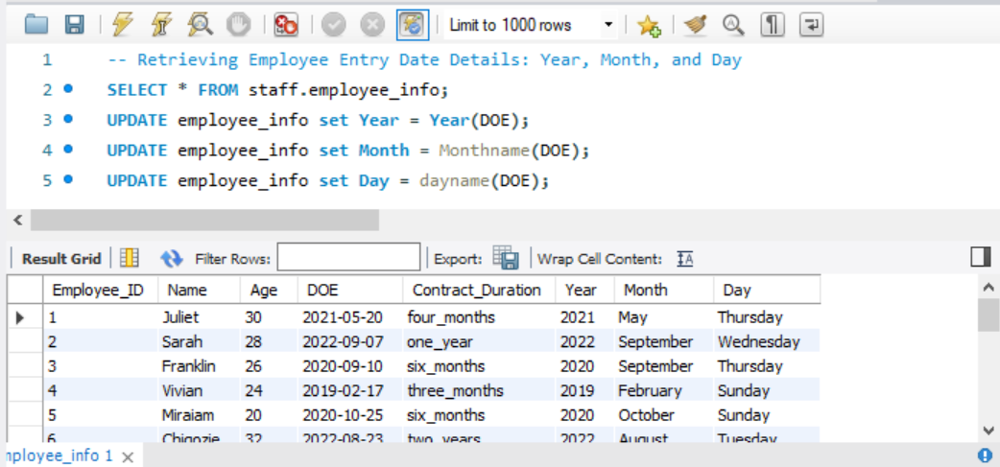

### 10. Execute and update a query to add 10 years to the entry year of each employee as their 'Year_of_Exit'.

To execute and update a query that adds 10 years to the entry year of each employee, creating a new column named 'Year_of_Exit' in the 'employee_info' table  using the 'ALTER' command would be done and subsequently the 'Year_of_Exit' column would be updated by adding 10 years to the employees' date of entry. The syntax for these operations are as follows:

```sql
ALTER Table_name ADD COLUMN New_column_name Date_type;
UPDATE Table_name
SET Column_name = DATE_ADD(Date_column, INTERVAL N); 

The specific command for this task is as follows:

ALTER Employee_Info ADD COLUMN Year_of_Exit DATE;
UPDATE Employee_Info
SET Year_of_Exit = DATE_ADD(DOE, INTERVAL 10 YEAR);

Executing these commands will add the 'Year_of_Exit' column and update it by adding 10 years to the date of entry for each employee in the 'employee_info' table.
```

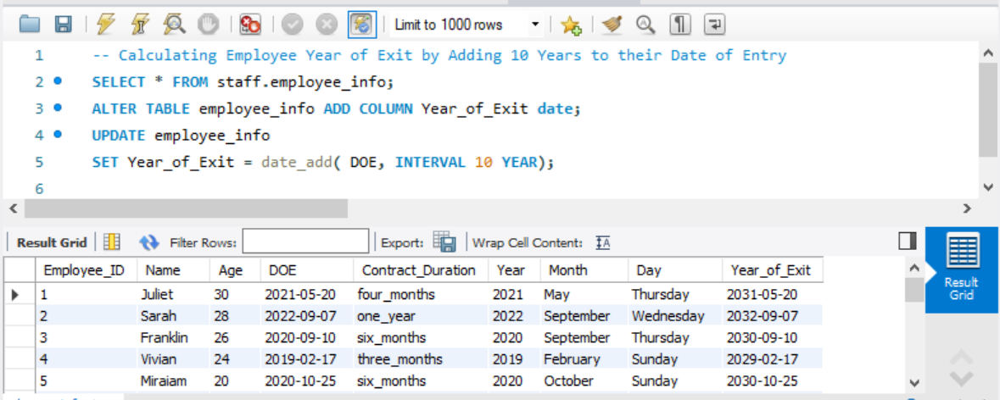

### 11.  Replace the department ‘Communications’ with ‘Stakeholders’:

To replace the department label 'Communications' with 'Stakeholders,' the 'UPDATE' command, coupled with the string function 'REPLACE,' will be employed. The syntax for this operation is as follows:

```sql
UPDATE Table_name
SET Column_name = REPLACE(Column_name, "old value", "new value");

The specific command for this task is outlined below:

UPDATE Employee_Salary
SET Department = REPLACE(Department, "Communications", "Stakeholders");

Executing this command will update the 'Department' column in the 'Employee_Salary' table, replacing occurrences of 'Communications' with 'Stakeholders.'
```

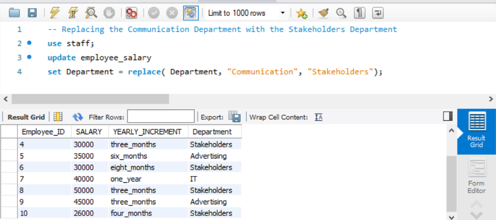

### 12. Modify the 'Name' column to ensure that all values are in UPPER CASE:

To adjust the 'Name' column, ensuring that all values are in uppercase, the 'UPPER' function will be employed. The syntax for this operation is as follows:

```sql
UPDATE Table_name
SET Column_name = UPPER(Column_name);

The specific command for this task is as follows:

UPDATE Employee_Info
SET Name = UPPER(Name);

Executing this command will update the 'Name' column in the 'Employee_Info' table, converting all values to uppercase.
```

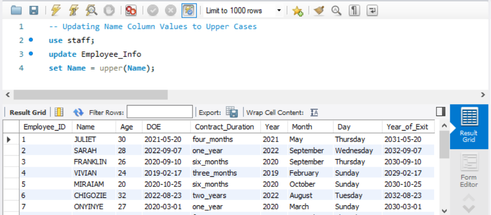

### 13. Execute a query to display the Employees' Names and Date of Entry (DOE) in a single column named 'Employee's Brief'.

To perform this task, initiate by creating a new column named 'Employees_Brief' using the 'ALTER' command. Subsequently, utilize the 'UPDATE' command along with the 'CONCAT' string function with the following syntax:

```sql
UPDATE Employee_Info
SET Employees_Brief = CONCAT(Name, " ", DOE);

Executing this command will concatenate the 'Name' and 'DOE' columns and update the 'Employees_Brief' column in the 'Employee_Info' table.
```

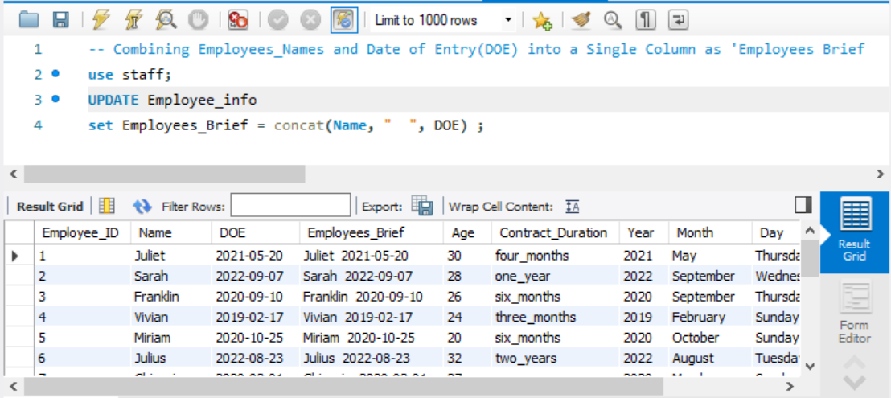

## CONCLUSION


    


